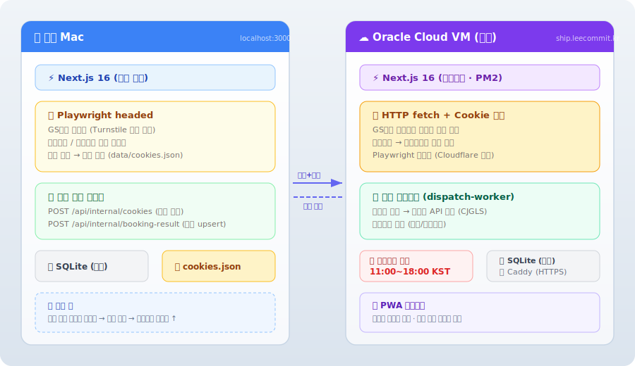

# Smart Ship Automation

> 네이버 스마트스토어 발송대기 주문을 GS편의점 택배에 자동으로 예약하는 로컬 웹 앱

---

## 기획 배경

네이버 스마트스토어에서 주문이 들어올 때마다 GS편의점 택배(cvsnet.co.kr)에 수령인 이름·주소·전화번호를 **하나하나 수동으로 입력**하는 반복 작업을 자동화하기 위해 개발했습니다.

**자동화 전 흐름**
```
네이버 셀러센터 → 주문 확인 → GS택배 사이트 열기 → 주소·수령인 직접 입력 → 예약 완료 (주문마다 반복)
```

**자동화 후 흐름**
```
앱 접속 → 주문 리스트 확인 → 선택 → 예약 버튼 클릭 → 완료
```

---

## 주요 기능

| 기능 | 설명 |
|------|------|
| **주문 동기화** | 네이버 커머스 API로 발송대기 주문 조회 → 로컬 DB 누적 저장 |
| **GS택배 자동 예약** | Playwright로 cvsnet.co.kr 폼 자동 입력 및 예약 완료 |
| **택배 유형 선택** | 국내택배 / 내일배송 선택 (내일배송 가능 지역 자동 판별) |
| **발송처리 자동화** | 예약 완료 후 운송장번호 자동 조회 → 네이버 발송처리 자동 호출 |
| **예약 로그 뷰어** | 예약 단계별 로그 + 오류 스크린샷 확인 |
| **재시도 로직** | 예약 실패 시 최대 2회 자동 재시도 (지수 백오프) |
| **설정 페이지** | 네이버 API 키 / GS택배 계정 / 보내는 사람 정보 UI 관리 |
| **PWA 지원** | 모바일 홈화면 설치, 오프라인 폴백 |

---

## 시스템 아키텍처



- **로컬**: GS택배 예약 (캡챠가 있어 사람이 보는 headed 브라우저 필요)
- **서버**: 운송장번호 조회 + 네이버 발송처리 폴링 자동 실행 (headless)
- 로컬에서 예약 완료 시 쿠키와 결과를 서버로 자동 동기화

---

## 기술 스택

| 분류 | 기술 |
|------|------|
| **프레임워크** | Next.js 16 (App Router) + TypeScript |
| **UI** | Tailwind CSS v4 + shadcn/ui |
| **브라우저 자동화** | Playwright (headed / headless 전환 가능) |
| **DB** | SQLite + Drizzle ORM + better-sqlite3 |
| **서버 상태** | TanStack Query (React Query) |
| **유효성 검사** | Zod v4 (외부 API 응답 파싱) |
| **테스트** | Vitest |
| **프로세스 관리** | PM2 (서버) |
| **리버스 프록시** | Caddy (자동 HTTPS) |

---

## 디렉토리 구조

```
src/
├── app/                    # Next.js App Router
│   ├── api/                # REST API 엔드포인트
│   │   ├── orders/         # 주문 조회·동기화·예약
│   │   ├── dispatch/       # 발송처리·운송장 동기화
│   │   ├── settings/       # 설정 CRUD·연결 테스트
│   │   ├── screenshots/    # 스크린샷 서빙
│   │   └── internal/       # 서버 내부 동기화 API
│   └── settings/           # 설정 페이지
├── components/             # React 컴포넌트
│   └── ui/                 # shadcn/ui (자동 생성)
├── lib/                    # 비즈니스 로직
│   ├── naver/              # 네이버 커머스 API 클라이언트
│   ├── gs-delivery/        # GS택배 Playwright 자동화
│   └── db/                 # SQLite + Drizzle ORM
└── types/                  # 공유 타입 정의

docs/                       # 프로젝트 문서
data/                       # SQLite DB 파일 (gitignore)
```

---

## 주요 설계 결정

### 왜 Next.js 로컬 웹 앱?
GS택배는 공식 API가 없어 Playwright 브라우저 자동화가 필수입니다. Playwright는 Node.js 네이티브 바이너리이므로 Electron/Tauri보다 Next.js + Node.js 환경이 가장 자연스럽습니다.

### 왜 SQLite?
별도 DB 서버 없이 파일 하나로 동작합니다. 1인 사용 앱에 PostgreSQL은 과잉이고, JSON 파일은 타입 안전성이 없습니다. WAL 모드로 동시성을 확보했습니다.

### 왜 Playwright headed 모드?
GS택배 로그인에 Cloudflare Turnstile 캡챠가 있어 완전 무인 자동화가 불가능합니다. 첫 로그인 시 사람이 캡챠를 통과하면 쿠키를 저장해 이후 예약은 자동으로 처리됩니다.

### 로컬 + 서버 분리 이유
예약(캡챠)은 로컬 Mac에서, 발송처리 폴링(운송장 조회→네이버 API)은 서버에서 자동으로 실행합니다. 모바일에서 진행 상황을 확인할 수 있도록 PWA 대시보드를 서버에 배포했습니다.

---

## 내일배송 가능 지역

```
서울특별시 전체
인천광역시: 계양구, 남동구, 부평구, 연수구
경기도: 고양시, 광명시, 군포시, 부천시, 성남시, 수원시, 안산시, 안양시
```

---

## 환경 변수 설정

`.env.local.example`을 복사하여 `.env.local`을 만들고 값을 채웁니다.

```bash
cp .env.local.example .env.local
```

| 변수 | 설명 |
|------|------|
| `NAVER_CLIENT_ID` | 네이버 커머스 API 클라이언트 ID |
| `NAVER_CLIENT_SECRET` | 네이버 커머스 API 클라이언트 시크릿 |
| `GS_USERNAME` | GS택배(cvsnet.co.kr) 아이디 |
| `GS_PASSWORD` | GS택배 비밀번호 |
| `SENDER_NAME` | 보내는 사람 이름 |
| `SENDER_PHONE` | 보내는 사람 전화번호 |
| `SENDER_ZIPCODE` | 보내는 사람 우편번호 |
| `SENDER_ADDRESS` | 보내는 사람 주소 |
| `DEPLOY_MODE` | `local` (기본) / `server` (서버 폴링 활성화) |
| `INTERNAL_API_KEY` | 내부 동기화 API 인증 키 |
| `SERVER_URL` | 서버 URL (미설정 시 로컬 전용 동작) |

> 설정 페이지(`/settings`)에서 UI로도 관리할 수 있습니다. DB 값이 환경 변수보다 우선합니다.

---

## 실행 방법

```bash
# 의존성 설치
npm install

# Playwright 브라우저 설치 (chromium만)
npx playwright install chromium

# 개발 서버 실행
npm run dev
# → http://localhost:3000

# 테스트 실행
npm test
```

### 첫 사용 순서

1. **설정 페이지** → 네이버 API 키, GS택배 계정, 보내는 사람 정보 입력
2. **동기화** 버튼 → 네이버 발송대기 주문 가져오기
3. 주문 선택 → **선택 건 예약** → GS택배 브라우저 자동 실행
4. 캡챠 최초 1회 수동 통과 → 이후 자동 예약
5. 예약 완료 후 운송장번호 자동 조회 → 네이버 발송처리 자동 완료

---

## 서버 배포 (Oracle Cloud VM)

```bash
# 서버 접속
ssh -i ~/.ssh/[key] ubuntu@[server-ip]

# 배포
cd smart-ship-automation
git pull
npm run build
pm2 restart smart-ship
```

서버 환경변수: `DEPLOY_MODE=server` 설정 시 `instrumentation.ts`에서 발송처리 폴링 자동 시작.

---

## API 엔드포인트

| 메서드 | 경로 | 설명 |
|--------|------|------|
| `GET` | `/api/orders` | 주문 목록 조회 |
| `POST` | `/api/orders/sync` | 네이버 주문 동기화 |
| `POST` | `/api/orders/book` | GS택배 예약 시작 |
| `PATCH` | `/api/orders/group` | 그룹 상태/택배유형 변경 |
| `GET` | `/api/orders/:id/logs` | 예약 로그 조회 |
| `GET` | `/api/screenshots/:filename` | 스크린샷 이미지 |
| `POST` | `/api/dispatch` | 수동 발송처리 |
| `POST` | `/api/dispatch/sync-tracking` | 운송장번호 동기화 |
| `GET/PUT` | `/api/settings` | 설정 조회/저장 |
| `POST` | `/api/settings/test-naver` | 네이버 API 연결 테스트 |
| `POST` | `/api/settings/test-gs` | GS택배 로그인 테스트 |

---

## 개발 히스토리

| Phase | 내용 | 완료일 |
|-------|------|--------|
| 1 | 프로젝트 셋팅 (Next.js + SQLite + Playwright) | 2026-03-15 |
| 2 | 네이버 커머스 API 연동 (OAuth, 주문 동기화) | 2026-03-15 |
| 3 | 대시보드 UI (주문 테이블, 상태 필터, 예약 다이얼로그) | 2026-03-15 |
| 4 | GS택배 Playwright 자동화 (예약 폼, 세션 관리) | 2026-03-16 |
| 5 | 설정 페이지 (API 키 UI 관리, 연결 테스트) | 2026-03-16 |
| 6 | 서버 배포 + 발송처리 자동화 + PWA | 2026-03-16 |
| 7 | 에러 핸들링 + 예약 로그 뷰어 | 2026-03-16 |

자세한 내용은 [`docs/project-history.md`](docs/project-history.md)를 참조하세요.
